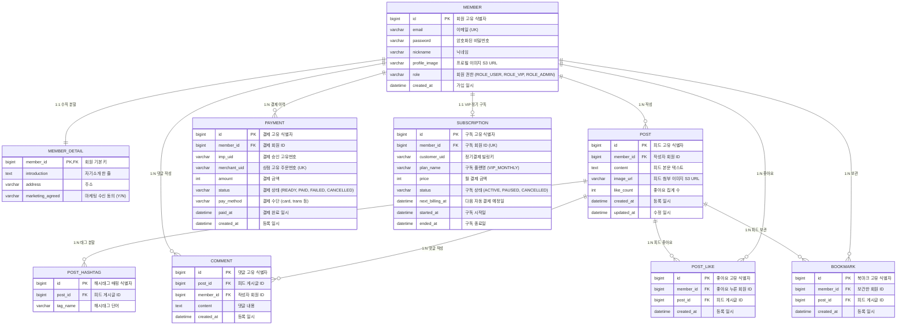

# 1. 데이터베이스 모델링 및 ERD 명세서 (사자그램 SNS)

## 목차
- [1. 데이터베이스 모델링 및 ERD 명세서 (사자그램 SNS)](#1-데이터베이스-모델링-및-erd-명세서-사자그램-sns)
- [1.1 엔티티 관계 다이어그램 (ERD)](#11-엔티티-관계-다이어그램-erd)
- [1.2 테이블별 상세 컬럼 명세](#12-테이블별-상세-컬럼-명세)

---

## 1.1 엔티티 관계 다이어그램 (ERD)

사자그램 서비스의 7개 핵심 도메인 테이블과 결제 및 정기 구독을 위한 2개 테이블의 전체 구조도.

---

## 1.2 테이블별 상세 컬럼 명세

### 1.2.1 member (회원 기본)
| 컬럼명 | 데이터 타입 | 제약 조건 | 설명 |
| :--- | :--- | :--- | :--- |
| id | BIGINT | PK, AUTO_INCREMENT | 회원 고유 식별자 |
| email | VARCHAR(100) | NOT NULL, UNIQUE | 로그인 아이디 (이메일) |
| password | VARCHAR(255) | NOT NULL | BCrypt 암호화된 비밀번호 |
| nickname | VARCHAR(50) | NOT NULL | 화면 표시용 닉네임 |
| profile_image | VARCHAR(255) | NULL | AWS S3 프로필 사진 URL |
| role | VARCHAR(20) | NOT NULL, DEFAULT 'ROLE_USER' | 권한 (ROLE_USER, ROLE_VIP, ROLE_ADMIN) |
| created_at | DATETIME | DEFAULT CURRENT_TIMESTAMP | 계정 생성 일시 |

### 1.2.2 member_detail (회원 상세 - 1:1 수직 분할)
| 컬럼명 | 데이터 타입 | 제약 조건 | 설명 |
| :--- | :--- | :--- | :--- |
| member_id | BIGINT | PK, FK (member.id ON DELETE CASCADE) | 회원 식별자 |
| introduction | TEXT | NULL | 자기소개 문구 |
| address | VARCHAR(255) | NULL | 사용자 거주 주소 |
| marketing_agreed | VARCHAR(1) | DEFAULT 'N' | 마케팅 정보 수신 동의 여부 (Y/N) |

### 1.2.3 post (피드 게시글)
| 컬럼명 | 데이터 타입 | 제약 조건 | 설명 |
| :--- | :--- | :--- | :--- |
| id | BIGINT | PK, AUTO_INCREMENT | 피드 게시글 고유 식별자 |
| member_id | BIGINT | NOT NULL, FK (member.id ON DELETE CASCADE) | 작성자 회원 식별자 |
| content | TEXT | NOT NULL | 피드 본문 내용 |
| image_url | VARCHAR(255) | NULL | 피드 첨부 이미지 S3 URL |
| like_count | INT | DEFAULT 0 | 좋아요 누적 카운트 |
| created_at | DATETIME | DEFAULT CURRENT_TIMESTAMP | 피드 최초 작성 일시 |
| updated_at | DATETIME | DEFAULT CURRENT_TIMESTAMP ON UPDATE | 피드 최종 수정 일시 |

### 1.2.4 post_hashtag (게시글 해시태그 - 제1정규형)
| 컬럼명 | 데이터 타입 | 제약 조건 | 설명 |
| :--- | :--- | :--- | :--- |
| id | BIGINT | PK, AUTO_INCREMENT | 해시태그 매핑 식별자 |
| post_id | BIGINT | NOT NULL, FK (post.id ON DELETE CASCADE) | 피드 게시글 식별자 |
| tag_name | VARCHAR(50) | NOT NULL | 해시태그 단어 (예: 여행, 일상) |

### 1.2.5 comment (피드 댓글)
| 컬럼명 | 데이터 타입 | 제약 조건 | 설명 |
| :--- | :--- | :--- | :--- |
| id | BIGINT | PK, AUTO_INCREMENT | 댓글 고유 식별자 |
| post_id | BIGINT | NOT NULL, FK (post.id ON DELETE CASCADE) | 댓글이 달린 피드 식별자 |
| member_id | BIGINT | NOT NULL, FK (member.id ON DELETE CASCADE) | 댓글 작성자 식별자 |
| content | TEXT | NOT NULL | 댓글 텍스트 내용 |
| created_at | DATETIME | DEFAULT CURRENT_TIMESTAMP | 댓글 등록 일시 |

### 1.2.6 post_like (피드 좋아요 - N:M 매핑)
| 컬럼명 | 데이터 타입 | 제약 조건 | 설명 |
| :--- | :--- | :--- | :--- |
| id | BIGINT | PK, AUTO_INCREMENT | 좋아요 식별자 |
| member_id | BIGINT | NOT NULL, FK (member.id ON DELETE CASCADE) | 좋아요를 누른 회원 ID |
| post_id | BIGINT | NOT NULL, FK (post.id ON DELETE CASCADE) | 대상 피드 게시글 ID |
| created_at | DATETIME | DEFAULT CURRENT_TIMESTAMP | 좋아요 등록 일시 |
- 고유 제약조건: UNIQUE KEY `uk_member_post_like` (`member_id`, `post_id`)

### 1.2.7 bookmark (피드 북마크 - N:M 매핑)
| 컬럼명 | 데이터 타입 | 제약 조건 | 설명 |
| :--- | :--- | :--- | :--- |
| id | BIGINT | PK, AUTO_INCREMENT | 북마크 식별자 |
| member_id | BIGINT | NOT NULL, FK (member.id ON DELETE CASCADE) | 북마크한 회원 ID |
| post_id | BIGINT | NOT NULL, FK (post.id ON DELETE CASCADE) | 대상 피드 게시글 ID |
| created_at | DATETIME | DEFAULT CURRENT_TIMESTAMP | 북마크 등록 일시 |
- 고유 제약조건: UNIQUE KEY `uk_member_post_bookmark` (`member_id`, `post_id`)

### 1.2.8 payment (결제 이력)
| 컬럼명 | 데이터 타입 | 제약 조건 | 설명 |
| :--- | :--- | :--- | :--- |
| id | BIGINT | PK, AUTO_INCREMENT | 결제 내역 식별자 |
| member_id | BIGINT | NOT NULL, FK (member.id ON DELETE CASCADE) | 결제 회원 ID |
| imp_uid | VARCHAR(100) | NULL | 결제 승인 고유 번호 |
| merchant_uid | VARCHAR(100) | NOT NULL, UNIQUE | 자체 생성 주문 식별자 (예: ORD_20260917_001) |
| amount | INT | NOT NULL | 결제 금액 |
| status | VARCHAR(20) | NOT NULL | 결제 상태 (READY, PAID, FAILED, CANCELLED) |
| pay_method | VARCHAR(30) | NOT NULL | 결제 수단 (card, point 등) |
| paid_at | DATETIME | NULL | 실제 결제 완료 시각 |
| created_at | DATETIME | DEFAULT CURRENT_TIMESTAMP | 결제 요청 시각 |

### 1.2.9 subscription (VIP 정기구독)
| 컬럼명 | 데이터 타입 | 제약 조건 | 설명 |
| :--- | :--- | :--- | :--- |
| id | BIGINT | PK, AUTO_INCREMENT | 구독 식별자 |
| member_id | BIGINT | NOT NULL, UNIQUE, FK (member.id ON DELETE CASCADE) | 구독 회원 식별자 |
| customer_uid | VARCHAR(100) | NOT NULL | 정기 결제 카드 빌링키 |
| plan_name | VARCHAR(50) | NOT NULL, DEFAULT 'VIP_MONTHLY' | 구독 플랜 이름 |
| price | INT | NOT NULL | 매월 정기 결제 금액 (예: 9,900원) |
| status | VARCHAR(20) | NOT NULL, DEFAULT 'ACTIVE' | 구독 상태 (ACTIVE, PAUSED, CANCELLED) |
| next_billing_at | DATETIME | NOT NULL | 다음 자동 결제 예정일 |
| started_at | DATETIME | DEFAULT CURRENT_TIMESTAMP | 최초 구독 시작일 |
| ended_at | DATETIME | NULL | 구독 해지 완료일 |
