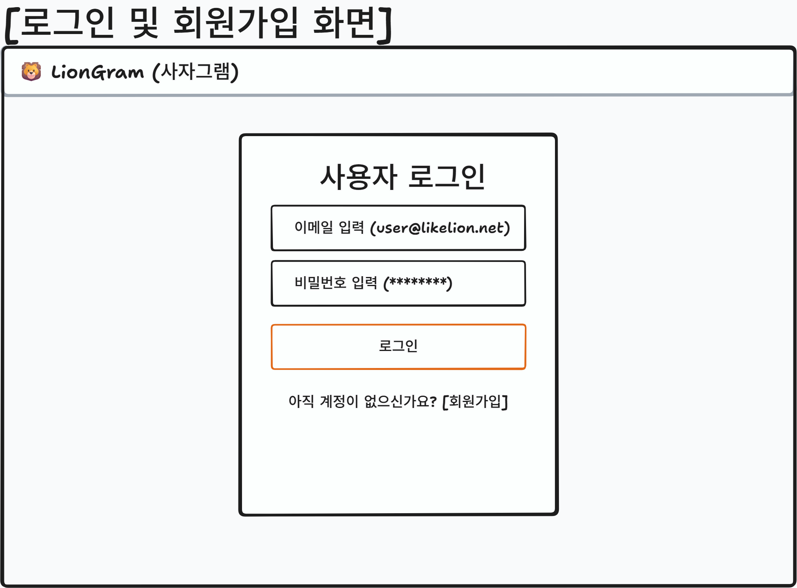
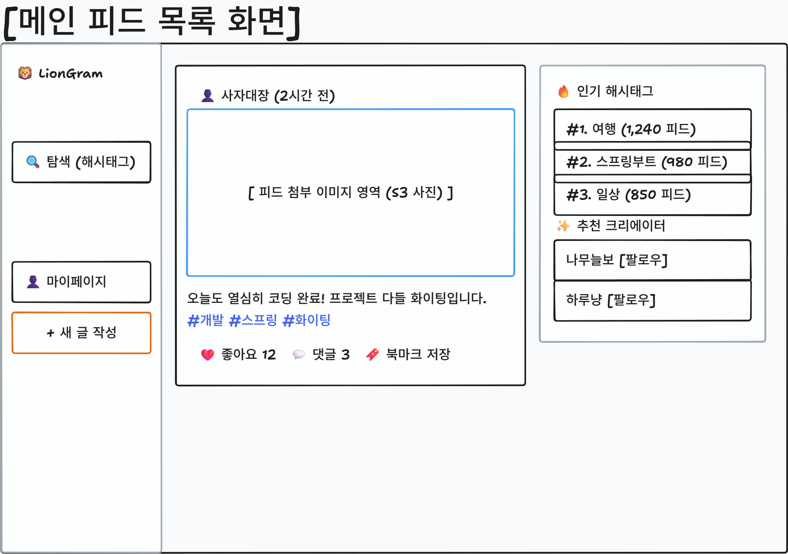
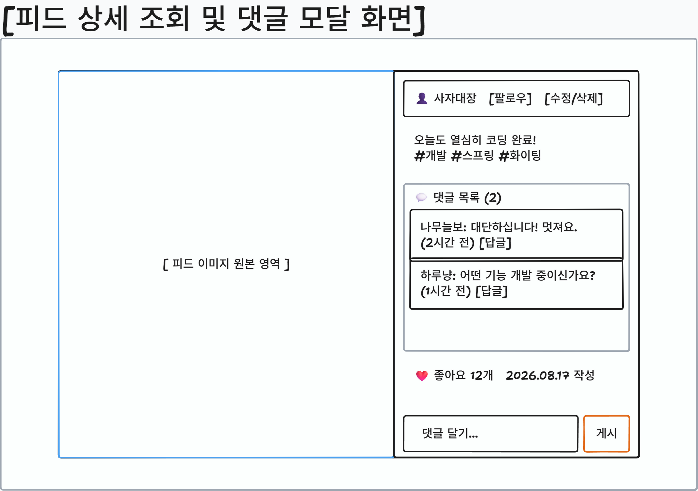
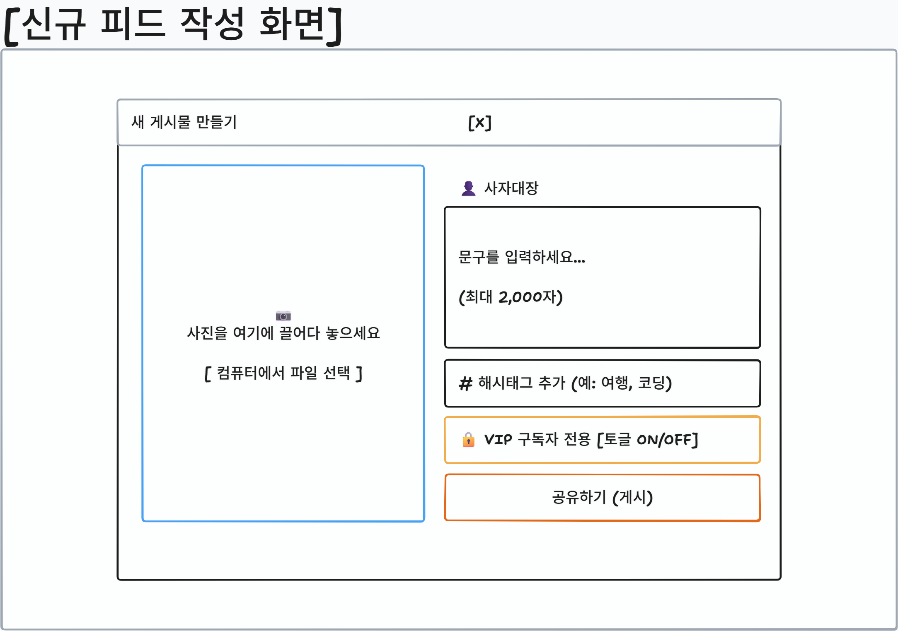
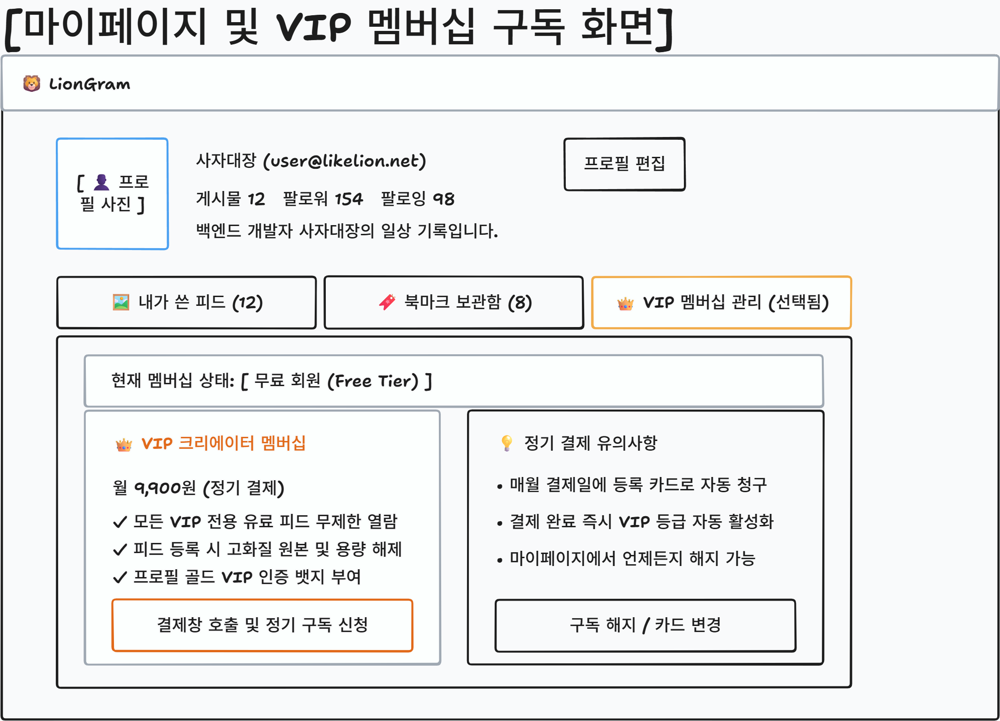
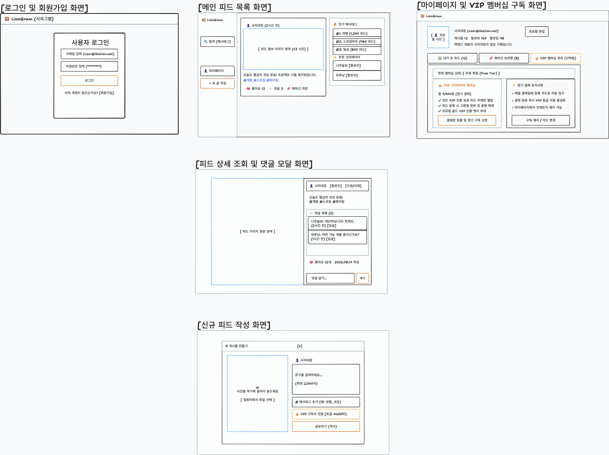

# 1. 화면 설계서 (UI Wireframe)

## 목차
- [1. 화면 설계서 (UI Wireframe)](#1-화면-설계서-ui-wireframe)
- [1.1 서비스 화면 구성 개요](#11-서비스-화면-구성-개요)
- [1.2 주요 화면별 명세](#12-주요-화면별-명세)
- [1.3 전체 화면 와이어프레임 배치도](#13-전체-화면-와이어프레임-배치도)

---

## 1.1 서비스 화면 구성 개요

### 1.1.1 주요 화면 목록
- [전체 화면 와이어프레임 배치도 (전체 보기)](#13-전체-화면-와이어프레임-배치도)
- 로그인 및 회원가입 화면 (`/login`, `/signup`)
- 메인 피드 목록 및 해시태그 탐색 화면 (`/`, `/explore`)
- 피드 상세 조회 및 댓글 모달 화면 (`/posts/{postId}`)
- 신규 피드 작성 및 이미지 업로드 화면 (`/posts/new`)
- 마이페이지 및 북마크/VIP 멤버십 관리 화면 (`/profile`, `/membership`)

---

## 1.2 주요 화면별 명세

### 1.2.1 로그인 및 회원가입 화면 (`/login`, `/signup`)

- 출력 데이터 항목 (Output Data):
  - 로고 및 헤더: 사자그램 서비스 로고 및 환영 문구
  - 입력 폼: 이메일 입력 필드, 비밀번호 입력 필드
  - 회원가입 추가 항목: 닉네임 입력 필드, 프로필 사진 업로드 필드, 한 줄 소개
  - 제어 버튼: 로그인 버튼, 회원가입 전환 링크, 간편 소셜 로그인 버튼
- 화면 제어 및 동작 규칙 (Behavior Rules):
  - 이메일 형식 정규식 및 비밀번호(영문/숫자/특수문자 8자리 이상) 유효성 실시간 검증
  - 로그인 성공 시 서버로부터 수신한 Access Token을 메모리/상태에 저장하고 메인 피드 화면으로 리다이렉트
  - 로그인 실패 시 에러 메시지(아이디 또는 비밀번호 불일치) 노출

### 1.2.2 메인 피드 목록 화면 (`/`)

- 출력 데이터 항목 (Output Data):
  - 좌측 내비게이션 바(GNB): 홈, 탐색, 알림, 북마크, 마이페이지, 새 글 작성 버튼
  - 중앙 피드 스트림: 피드 카드 목록 (작성자 프로필, 닉네임, 작성 시간, 피드 이미지, 본문 내용, 해시태그 칩 목록)
  - 상호작용 요소: 하트 아이콘(좋아요 수), 말풍선 아이콘(댓글 수), 북마크 아이콘
  - 우측 사이드바: 실시간 인기 해시태그 목록, 추천 크리에이터 프로필 목록
- 화면 제어 및 동작 규칙 (Behavior Rules):
  - 스크롤 하단 도달 시 다음 페이지 피드 자동 요청 (무한 스크롤 무중단 로딩)
  - 해시태그 칩 클릭 시 해당 태그 피드 필터링 목록 화면으로 이동
  - 피드 본문 또는 이미지 클릭 시 피드 상세 모달 창 활성화
  - 좋아요 아이콘 클릭 시 빨간색 채움 상태로 토글 및 카운트 +1 즉각 반영 (낙관적 업데이트)
  - 북마크 아이콘 클릭 시 저장 상태 토글

### 1.2.3 피드 상세 조회 및 댓글 모달 화면 (`/posts/{postId}`)

- 출력 데이터 항목 (Output Data):
  - 좌측 영역: 고화질 피드 이미지 원본 비율 표시
  - 우측 상단 영역: 작성자 아바타, 닉네임, 팔로우 버튼, 더보기(수정/삭제) 메뉴
  - 우측 중앙 영역: 본문 텍스트, 해시태그, 작성일시, 스크롤 가능한 댓글 목록 (댓글 작성자 아바타, 닉네임, 댓글 내용, 등록 시간, 삭제 버튼)
  - 우측 하단 영역: 댓글 작성 입력창, 등록 버튼, 좋아요/북마크 버튼
- 화면 제어 및 동작 규칙 (Behavior Rules):
  - 본인이 작성한 피드인 경우에만 수정/삭제 옵션 노출
  - 댓글 입력창에 내용 입력 후 전송 시 즉시 댓글 목록 최하단에 렌더링
  - 본인이 작성한 댓글에만 삭제(휴지통) 아이콘 노출 및 삭제 확인 팝업

### 1.2.4 신규 피드 작성 화면 (`/posts/new`)

- 출력 데이터 항목 (Output Data):
  - 상단 바: 작성 취소 버튼, 게시하기 등록 버튼
  - 미디어 업로드 영역: 드래그 앤 드롭 파일 선택 영역, 업로드된 이미지 미리보기 및 제거 버튼
  - 본문 입력 영역: 피드 내용 멀티라인 텍스트 영역, 글자 수 카운터 (최대 2,000자)
  - 해시태그 입력 영역: 태그 입력창 (# 입력 시 태그 칩 생성)
  - 공개 범위 설정: 전체 공개 또는 VIP 구독자 전용 피드 토글 스위치
- 화면 제어 및 동작 규칙 (Behavior Rules):
  - 이미지 파일 선택 시 브라우저에서 미리보기 URL(URL.createObjectURL) 생성하여 즉시 확인
  - 게시하기 클릭 시 이미지를 AWS S3로 전송하고 반환된 URL과 본문, 해시태그 배열을 백엔드 API로 전송
  - 등록 완료 시 메인 피드 최상단으로 이동

### 1.2.5 마이페이지 및 VIP 멤버십 구독 화면 (`/profile`, `/membership`)

- 출력 데이터 항목 (Output Data):
  - 프로필 헤더: 프로필 사진, 닉네임, 한 줄 소개, 게시글 수, 팔로워 수, 프로필 수정 버튼
  - 탭 메뉴: 내가 쓴 피드 탭, 북마크 보관함 탭, VIP 멤버십 구독 관리 탭
  - VIP 멤버십 탭 영역: 현재 등급 상태(무료 회원 또는 VIP 구독 중), 다음 결제 예정일, 등록된 결제 카드 정보
  - 멤버십 가입 카드: 월 9,900원 VIP 플랜 혜택 안내 (유료 독점 피드 열람, 무제한 북마크, 프로필 VIP 배지)
  - 결제 제어 버튼: 결제창 호출 버튼(SDK 연동), 구독 해지 버튼
- 화면 제어 및 동작 규칙 (Behavior Rules):
  - 북마크 탭 클릭 시 본인이 북마크한 피드 썸네일 그리드 목록 표시
  - VIP 구독하기 버튼 클릭 시 브라우저 결제창 SDK를 호출하여 카드 등록 및 빌링키 발급 진행
  - 결제 승인 완료 콜백 수신 후 백엔드 검증 API 호출 및 화면의 회원 등급 배지를 VIP로 즉시 갱신

---

## 1.3 전체 화면 와이어프레임 배치도

